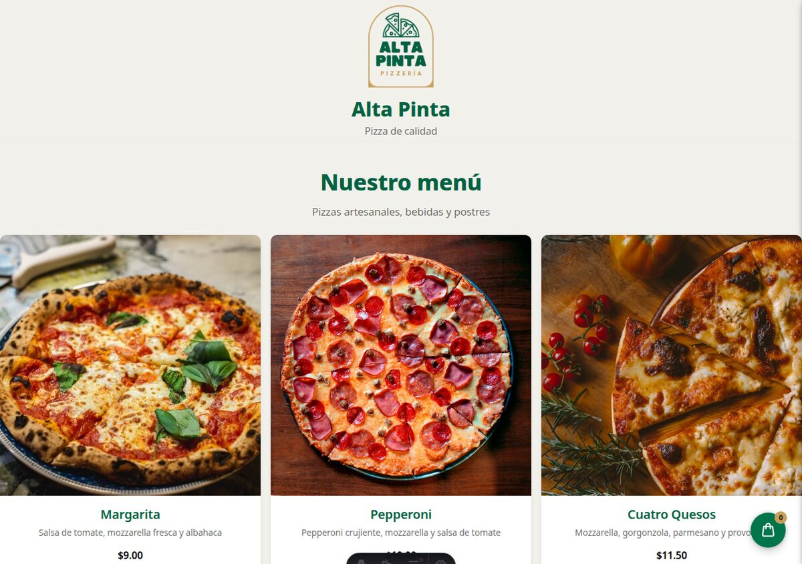

# 🍕 Alta Pinta — Pizzería

Sitio web estático de **Alta Pinta** que lee el menú desde Google Sheets, permite armar un carrito y envía las órdenes a la hoja de pedidos vía Google Apps Script.

> **🔴 Live**: [alta-pinta.coltmandev.dev](https://alta-pinta.coltmandev.dev/)

<p align="center">
  
</p>

---

## 📖 Resumen del proyecto

**Alta Pinta** es una pizzería cuyo sitio funciona como un menú digital en vivo: los productos viven en una hoja de Google Sheets y se muestran en la página al cargar, así que **editar la hoja actualiza el sitio sin redeploy**. El cliente arma su carrito (puede elegir tamaño y cantidad) y lo envía como una orden; el backend la valida, recalcula el total y la guarda en la pestaña de pedidos.

**Flujo**: Google Sheets (`menu`) → Web App `doGet` (JSON) → isla Astro (fetch client-side) → tarjetas → carrito → POST `text/plain` → Web App `doPost` → Google Sheets (`ordenes`).

**Características**:
- Menú con categorías (pizzas, bebidas, postres) y tamaños escalonados (pequeña/mediana/grande, +20% por nivel).
- Carrito client-side con drawer, cantidad editable y eliminación por item.
- Checkout con nombre + email; modal de confirmación al enviar la orden.
- Backend defensivo: validación server-side, recálculo del total (no confía en el cliente), sanitización anti-fórmulas y rate-limit.

---

## 🍕 Cómo preparar una pizza

¿Quieres una pizza casera perfecta? Sigue estos pasos simples:

1. **Precalienta el horno** a 250 °C (con una piedra o bandeja dentro).
2. **Estira la masa** sobre harina hasta ~5 mm y colócala en la bandeja.
3. **Cubre con salsa** de tomate dejando 1 cm de borde.
4. **Añade queso** mozzarella y tus ingredientes favoritos.
5. **Hornea 10–12 min** hasta que el queso burbujee y el borde se dore.
6. **Saca, corta y disfruta.**

---

## 🎨 Diseño

Identidad **Starbucks** (getdesign) adaptada con el color de marca del logo (verde Siren) y un acento oro. Sistema de tokens en `src/app/styles/global.css` + especificación en `DESIGN.md`. Elemento firma: botón flotante **Frap** para el carrito.

---

## ⚡ Stack

- **Astro 7** — sitio estático (`output: static`), con una isla vanilla TS para el carrito.
- **Google Sheets** — base de datos (pestañas `config`, `categorias`, `menu`, `ordenes`).
- **Google Apps Script Web App** — puente `doGet` (lee menú) / `doPost` (agrega orden).
- **Tailwind CSS v4** — utilitarios sobre tokens de diseño.
- **Vitest** — tests unit de la lógica de dominio (28).
- **Playwright** — tests e2e del flujo completo.

---

## 🗂️ Estructura del proyecto (completa)

Arquitectura **Screaming Architecture**: la estructura grita el dominio, no la tecnología. `domain/` es lógica pura (testeable), `app/` orquesta la UI, `infrastructure/` aísla el mundo exterior.

```
Take-home/
├── AGENTS.md / CLAUDE.md     # Instrucciones de desarrollo para agentes AI
├── DESIGN.md                 # Sistema de diseño (tokens, colores, tipografía, componentes)
├── README.md                 # Este archivo (descripción + guía)
├── astro.config.mjs          # Config de Astro (Tailwind v4 vía Vite)
├── package.json              # Dependencias y scripts (dev/build/test/e2e/astro)
├── playwright.config.ts      # Config de Playwright (e2e)
├── vitest.config.ts          # Config de Vitest (tests unit de dominio)
├── tsconfig.json             # TypeScript (strict)
├── .env.example              # Plantilla: PUBLIC_SHEETS_URL (la URL del Web App)
│
├── src/                      # Código fuente
│   ├── domain/               # 📚 LÓGICA DE NEGOCIO pura — sin framework ni DOM — unit-tested
│   │   ├── menu/             #   Modelo y acceso al catálogo: MenuItem, PriceTier, parseMenuEntry, fetchMenu
│   │   │   ├── MenuItem.ts   #   Tipos del menú (MenuItem, PriceTier)
│   │   │   ├── menu.ts       #   parseMenuEntry + fetchMenu (normaliza/valida/obtiene el menú)
│   │   │   └── menu.test.ts  #   Tests del menú
│   │   ├── cart/             #   Modelo y lógica del carrito
│   │   │   ├── CartItem.ts   #   Tipo CartItem
│   │   │   ├── cart.ts       #   add/remove/setQty, totales (aritmética en centavos)
│   │   │   ├── store.ts      #   Store reactivo mínimo (vanilla, con persistencia localStorage)
│   │   │   └── cart.test.ts  #   Tests del carrito
│   │   └── order/            #   Modelo y lógica del pedido
│   │       ├── types.ts      #   OrderPayload / OrderResult
│   │       ├── order.ts      #   validateOrder, buildOrderPayload, postOrder
│   │       └── order.test.ts #   Tests del pedido
│   │
│   ├── app/                  # 🎨 PRESENTACIÓN + orquestación client-side
│   │   ├── layout/           #   BaseLayout.astro (html, head, meta, favicon, lang=es)
│   │   │   └── BaseLayout.astro
│   │   ├── components/       #   Componentes Astro reutilizables (server-rendered)
│   │   │   ├── Header.astro          # Marca + logo + tagline
│   │   │   ├── Hero.astro            # Título de página ("Nuestro menú")
│   │   │   ├── MenuGrid.astro        # Grid de productos + skeleton + estado de error
│   │   │   ├── CartDrawer.astro      # Drawer lateral del carrito + checkout (nombre/email)
│   │   │   ├── FrapButton.astro      # Botón flotante de carrito (elemento firma)
│   │   │   ├── OrderSuccessModal.astro  # Modal de confirmación post-compra
│   │   │   └── Footer.astro          # Bookend House Green + enlace al repo
│   │   ├── island.ts         #   initIsland(): conecta dominio con DOM (fetch, render, eventos)
│   │   └── styles/           #   global.css — design tokens (Starbucks) + Tailwind @theme
│   │       └── global.css
│   │
│   ├── infrastructure/       # 🔌 ADAPTADORES del mundo exterior
│   │   ├── env.ts            #   PUBLIC_SHEETS_URL tipado + fail-visible
│   │   └── sheets/           #   El puente con Google (Apps Script)
│   │       ├── Code.gs       #   doGet (lee menú) / doPost (agrega orden) — backend defensivo
│   │       └── appsscript.json  #   Manifest: executeAs=Me, acceso Anyone, oauthScopes
│   │
│   └── pages/
│       └── index.astro       #   Página única: Header + Hero + MenuGrid + Footer + Frap + Drawer + Modal
│
├── apps-script/              # Mirror del proyecto Apps Script (para deploy con clasp)
│   ├── Code.js               #   Mismo código que src/infrastructure/sheets/Code.gs
│   ├── appsscript.json       #   Manifest (idéntico)
│   └── .clasp.json           #   Conexión local→proyecto Apps Script (scriptId)
│
├── public/                   # Archivos estáticos servidos tal cual
│   ├── favicon.ico / favicon.svg  # Favicon con el logo de la marca
│   ├── logo-pizzería-minimalista.svg|webp|png  # Logo de Alta Pinta (3 formatos)
│   └── img/                  # Imágenes de producto (pz-*, beb-*, pos-*.jpg)
│
├── sheets/                   # Datos base (CSV delimitados con ";") para poblar Google Sheets
│   ├── config.csv            # rubro, marca, moneda, slogan, logo
│   ├── categorias.csv        # id, nombre, orden
│   ├── menu.csv              # 15 productos (precio + tipos JSON escalonados)
│   └── ordenes.csv           # esquema de pedidos
│
├── e2e/                      # Tests end-to-end (Playwright)
│   ├── site.spec.ts          # Flujo completo contra el Web App real
│   └── cart-ux.spec.ts       # UX del carrito (fetch mockeado): drawer, stepper, cantidad, eliminar
│
├── docs/                     # 📄 DOCUMENTACIÓN DEL PROYECTO
│   ├── context.md            # Contexto, stack, arquitectura, decisiones
│   ├── roadmap.md            # Fases SDD, hitos, pendientes
│   ├── chat.md               # 📝 Log completo de chats/decisiones (cómo se construyó) — ¡visible!
│   ├── apps-script-setup.md  # Guía paso a paso del deploy del Apps Script
│   └── img/site-menu.jpg     # Captura del sitio con productos cargados
│
├── openspec/                 # SDD con OpenSpec
│   ├── config.yaml           # Config del spec (test runner, reglas)
│   └── changes/pizza-menu-orders/
│       └── spec.md           # Especificación del cambio (requisitos, escenarios)
└── node_modules/             # Dependencias (no versionado)
```

> 📌 **`docs/chat.md`** es el registro vivo de cómo se tomó cada decisión del proyecto — la trazabilidad completa del proceso de construcción. Se mantiene actualizado con cada intercambio.

---

## 🚀 Puesta en marcha local

```bash
# 1. Instalar dependencias
npm install

# 2. Configurar variables de entorno
cp .env.example .env
# → pega la URL del Web App de Apps Script en PUBLIC_SHEETS_URL

# 3. Levantar en desarrollo
npm run dev
```

---

## 🧪 Tests

```bash
npm test          # unit (Vitest) — lógica de dominio
npm run test:e2e  # e2e (Playwright) — flujo completo con el Web App real
npm run build     # build estático
```

---

## 📄 Setup de Google Apps Script (back-end)

1. Crea una hoja de cálculo **`pizza-alta`** con las pestañas `config`, `categorias`, `menu`, `ordenes` (los CSVs están en `sheets/`).
2. Crea un proyecto de Apps Script, pega `src/infrastructure/sheets/Code.gs`, y configura el `SHEET_ID` (el ID de tu hoja).
3. Despliega como **Web App**: *Ejecutar como: Yo* · *Acceso: Cualquier persona*.
4. Copia la URL resultante a `.env` → `PUBLIC_SHEETS_URL`.

> 📖 Guía paso a paso completa en `docs/apps-script-setup.md`.

---

## 🌐 Despliegue

Sitio estático — publícalo donde prefieras (GitHub Pages, Vercel, Netlify):

```bash
npm run build   # genera dist/
```

- **GitHub Pages**: push a un repo + GitHub Actions con `base: '/repo-nombre/'`.
- **Vercel**: `vercel deploy --prod` (zero-config).

---

## 🔗 Código fuente

📦 Repositorio: [github.com/juanvs23/Take-home](https://github.com/juanvs23/Take-home)

---

Hecho con Astro + Google Sheets. 🍕
